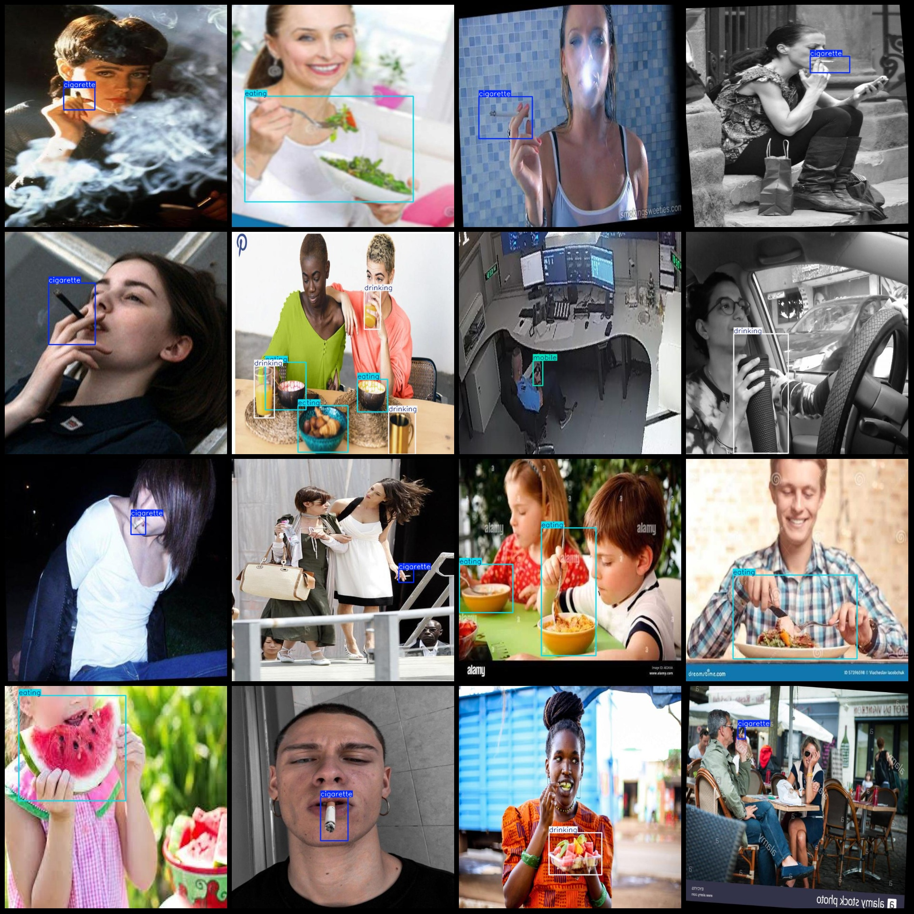
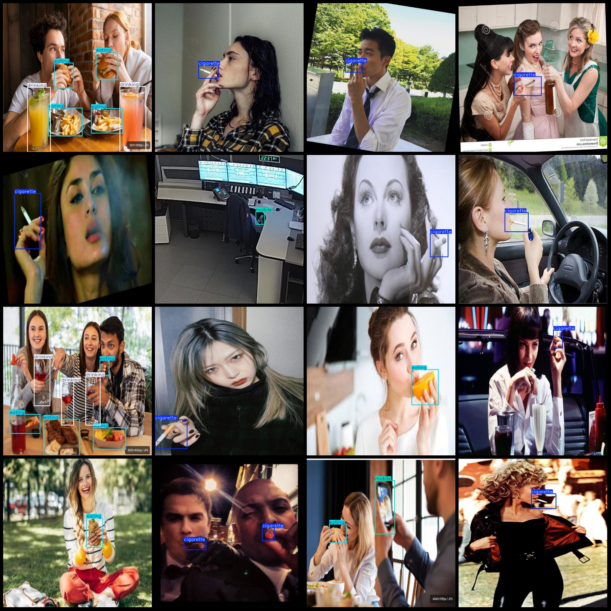

# Smoking Phone Call Eating Detection Dataset VOC+YOLO Format: 1876 Images, 4 Categories

Dataset format: Pascal VOC format + YOLO format (without split path in txt files, only containing jpg images along with corresponding VOC format xml files and yolo format txt files)
Number of images (jpg file count): 1876
Number of annotations (xml file count): 1876
Number of annotations (txt file count): 1876
Number of annotation categories: 4
Annotation category names: ["cigarette", "drinking", "eating", "mobile"] (Note that the order of yolo format category names does not correspond to this, but is based on the labels folder's classes.txt)
Box count for each category:
- Cigarette (smoke) box count = 952
- Drinking (water) box count = 410
- Eating (eat) box count = 1144
- Mobile (phone) box count = 247
Total box count: 2753
Image resolution: 640x640
Used labeling tool: labelImg
Labeling rules: draw boxes around the categories
Important note: No guarantees are made regarding the accuracy of trained models or weight files
Preview of images:
Annotation example:

## Images

Here is a pay link on Stripe ( https://buy.stripe.com/3cs8yP7sY87d0vu9AB ). Please contact me lonlonago@foxmail.com after funding $89, and I will send you a complete data files , thank you!

